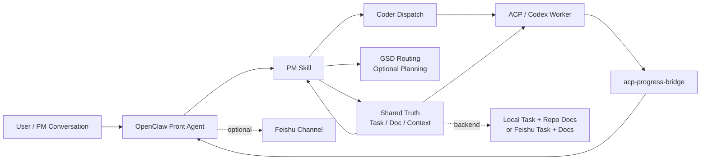

# OpenClaw Coding Kit

[](https://github.com/GalaxyXieyu/openclaw-coding-kit)


> A production-minded collaboration kit for running `PM + coder + OpenClaw + ACPX + progress bridge` as one stable delivery loop.

`OpenClaw Coding Kit` is not a one-off demo scaffold.  
It packages a repeatable working model for complex delivery: requirement intake, task routing, coding execution, progress relay, and optional Feishu synchronization.


## Why This Exists

Most AI coding setups break down for the same reasons:

- business discussion and implementation details collapse into one polluted session
- PM-side context and coder-side execution do not share the same truth
- progress from sub-sessions is hard to route back into the parent workflow
- installation instructions, runtime config, and actual operator flow drift apart over time

This repository addresses that by separating roles and making the execution path explicit:

- `PM` owns task intake, context refresh, document sync, and routing
- `coder` owns implementation and validation inside ACP sessions
- `acp-progress-bridge` owns progress/completion relay only
- `Feishu task/doc` is optional collaboration truth in integrated mode
- `local task + repo docs` provides a low-friction local-first mode

## What You Get

| Area | Included | Purpose |
|---|---|---|
| Task orchestration | `skills/pm` | task intake, context refresh, doc sync, GSD routing |
| Execution worker | `skills/coder` | canonical ACP coding worker |
| Feishu bridge reuse | `skills/openclaw-lark-bridge` | calls Feishu tools from a running OpenClaw gateway |
| Progress relay | `plugins/acp-progress-bridge` | sends child-session progress and completion back to the parent |
| Config references | `examples/*` | minimal and extended config snippets |
| Verification | `tests/*` | repo-local validation baseline |

## Best For

Use this repository when you want:

- a local-first validation path before touching real collaboration systems
- a clearer boundary between PM reasoning and coder execution
- a repeatable OpenClaw + Codex + ACP workflow instead of one long improvised session
- optional Feishu integration without making Feishu a hard prerequisite for smoke checks

This repository is not trying to replace OpenClaw itself.  
It is an operator kit layered on top of OpenClaw.

## Architecture At A Glance



Editable diagram sources:

- [`diagrams/openclaw-coding-kit-architecture.svg`](/Volumes/DATABASE/code/learn/openclaw-pm-coder-kit/diagrams/openclaw-coding-kit-architecture.svg)
- [`diagrams/openclaw-coding-kit-architecture.drawio`](/Volumes/DATABASE/code/learn/openclaw-pm-coder-kit/diagrams/openclaw-coding-kit-architecture.drawio)

## Operating Modes

### Local-First

Start here if your goal is to verify the repository, not the whole collaboration stack.

Recommended config:

```json
{
  "task": { "backend": "local" },
  "doc": { "backend": "repo" },
  "coder": { "backend": "codex-cli", "agent_id": "codex" }
}
```

Good for:

- smoke checks
- PM/coder/GSD routing validation
- bootstrap verification
- installation debugging without Feishu
- Telegram/local-first delivery with Codex CLI as the default worker path

### Integrated

Use this when you want the real collaboration loop:

- Codex + OpenClaw runtime
- agent binding and ACP execution
- Feishu bot / group / task / doc integration
- progress bridge and authorization flows

Current operator recommendation on OpenClaw `2026.3.24`:

- keep `coder.backend = "codex-cli"` as the default config for local-first operation
- keep `backend=acp` available as an explicit path when you want native ACP child sessions
- only enable automatic ACP routing when you explicitly set `coder.auto_switch_to_acp = true`
- if `sessions_spawn` is used through Gateway HTTP, expose it with `gateway.tools.allow = ["sessions_spawn", "sessions_send"]`

## Quick Start

If you want the fastest meaningful validation path, do not start with Feishu. Run:

```bash
python3 -m py_compile skills/pm/scripts/*.py skills/coder/scripts/*.py
python3 skills/pm/scripts/pm.py init --project-name demo --task-backend local --doc-backend repo --dry-run
python3 skills/pm/scripts/pm.py context --refresh
python3 skills/pm/scripts/pm.py route-gsd --repo-root .
```

Once that passes, move to:

1. runtime and dependency checks
2. OpenClaw / Codex asset deployment
3. config wiring
4. optional Feishu setup
5. real backend initialization

Full operator flow:

- [`INSTALL.md`](/Volumes/DATABASE/code/learn/openclaw-pm-coder-kit/INSTALL.md)

## Installation Strategy

Recommended order:

1. install runtime prerequisites first
2. verify repo-local smoke path
3. deploy `pm`, `coder`, `openclaw-lark-bridge`, and `acp-progress-bridge`
4. wire `openclaw.json` and `pm.json`
5. only then add Feishu bot, group, permissions, and OAuth when required
6. finish with real backend initialization and E2E verification

That order is intentional.  
It keeps runtime problems, config problems, and collaboration-system problems from collapsing into one debugging session.

## Repository Layout

```text
openclaw-coding-kit/
  README.md
  INSTALL.md
  examples/
    openclaw.json5.snippets.md
    pm.json.example
  plugins/
    acp-progress-bridge/
  skills/
    coder/
    openclaw-lark-bridge/
    pm/
  tests/
  diagrams/
    openclaw-coding-kit-architecture.drawio
    openclaw-coding-kit-architecture.svg
```

## Design Principles

- `PM` is the tracked-work front door
- `coder` executes; it does not own task/doc truth
- `GSD` owns roadmap/phase planning, not task/doc truth
- `bridge` is a relay, not a source of truth
- default to `local/repo` first, real Feishu second
- keep the OpenClaw baseline on `2026.3.22`, not `2026.4.5+`

## Feishu Integration Notes

If you enable `@larksuite/openclaw-lark`:

- bot creation, sensitive permission approval, version publishing, and `/auth` / `/feishu auth` still include manual user steps
- PM now supports common `env` / `file` / `exec` SecretRef resolution for `appSecret`
- do not keep both built-in `plugins.entries.feishu` and `openclaw-lark` enabled at the same time

That last point matters. Duplicate Feishu tool registration can cause tool conflicts and, in heavier environments, even destabilize CLI introspection.

Detailed install and permission guidance:

- [`INSTALL.md`](/Volumes/DATABASE/code/learn/openclaw-pm-coder-kit/INSTALL.md)

## Compatibility

| Item | Baseline |
|---|---|
| Python | `>= 3.9` |
| Node.js | `>= 22` |
| OpenClaw | `2026.3.22` |
| PM state dir | prefers `openclaw-coding-kit`, still falls back to legacy `openclaw-pm-coder-kit` |

## Included References

- [`INSTALL.md`](/Volumes/DATABASE/code/learn/openclaw-pm-coder-kit/INSTALL.md)
- [`examples/pm.json.example`](/Volumes/DATABASE/code/learn/openclaw-pm-coder-kit/examples/pm.json.example)
- [`examples/openclaw.json5.snippets.md`](/Volumes/DATABASE/code/learn/openclaw-pm-coder-kit/examples/openclaw.json5.snippets.md)

## Security

Do not commit:

- real `appId` / `appSecret`
- OAuth token or device auth state
- real group IDs, allowlists, user identifiers
- real tasklist GUIDs or document tokens
- local session stores or runtime caches
