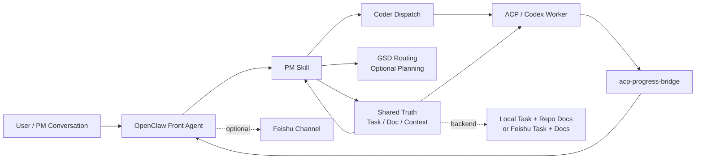

# OpenClaw Coding Kit

`OpenClaw Coding Kit` 是一套面向复杂项目交付的协作工程资产。

它把 `PM`、`coder`、`OpenClaw`、`ACPX`、`progress bridge` 和可选的 `Feishu` 集成收敛成一条更稳定的执行链路，让需求澄清、任务分发、编码执行和结果回流不再散落在多个临时会话里。

## Overview

这个仓库解决的不是“如何再包一层 AI 脚手架”，而是更实际的问题：

- 需求沟通、任务拆解、代码执行混在一个长会话里，容易上下文污染
- PM 侧和 coder 侧没有共享事实源，任务状态容易漂移
- 多会话、多子任务并发后，进度和结果难以稳定回流

这套 kit 的核心做法是：

- 用 `PM` 承接需求、任务、文档和上下文组织
- 用 `coder` 承接 ACP coding session 的实现与验证
- 用 `acp-progress-bridge` 负责把子会话进度与完成结果回推到父会话
- 在集成模式下，用 `Feishu task/doc` 作为团队可见的协作 truth
- 在本地模式下，用 `local task + repo docs` 先完成最小闭环

## Architecture

GitHub 直接预览版本：



可编辑架构源文件见：

- [`diagrams/openclaw-coding-kit-architecture.drawio`](/Volumes/DATABASE/code/learn/openclaw-pm-coder-kit/diagrams/openclaw-coding-kit-architecture.drawio)

## What You Get

| Capability | Purpose |
|---|---|
| `skills/pm` | 任务入口、上下文刷新、文档同步、GSD 路由 |
| `skills/coder` | ACP coding session 的标准执行 worker |
| `skills/openclaw-lark-bridge` | 复用 OpenClaw Gateway 内已加载的飞书工具 |
| `plugins/acp-progress-bridge` | 子会话进度与完成结果回推 |
| `examples/*` | 最小配置与增强配置片段 |
| `tests/*` | repo-local 验证基线 |

## Operating Modes

### 1. Local-First

先验证仓库和执行链路是否健康，不依赖真实 Feishu。

典型配置：

```json
{
  "task": { "backend": "local" },
  "doc": { "backend": "repo" }
}
```

适合：

- 先验证安装是否可靠
- 先跑通 PM / coder / GSD 路由
- 先在本地完成 smoke check

### 2. Integrated

把仓库资产接入真实 `Codex + OpenClaw + Feishu` 环境。

适合：

- 多人协作
- 群聊驱动任务
- 真实 task/doc 同步
- 需要 progress bridge 和授权链路

## Quick Start

如果你只想先验证这套 kit 能不能跑，不要一上来就接 Feishu。先跑这 3 步：

```bash
python3 -m py_compile skills/pm/scripts/*.py skills/coder/scripts/*.py
python3 skills/pm/scripts/pm.py init --project-name demo --task-backend local --doc-backend repo --dry-run
python3 skills/pm/scripts/pm.py context --refresh
```

通过以后再继续：

```bash
python3 skills/pm/scripts/pm.py route-gsd --repo-root .
```

完整安装与远端接入流程看：

- [`INSTALL.md`](/Volumes/DATABASE/code/learn/openclaw-pm-coder-kit/INSTALL.md)

## Installation Path

推荐的 operator 顺序是：

1. 先装运行时：`python3 >= 3.9`、`node >= 22`、`openclaw = 2026.3.22`
2. 先跑 repo-local smoke
3. 再部署 `pm` / `coder` / `openclaw-lark-bridge` / `acp-progress-bridge`
4. 再写 `openclaw.json` / `pm.json`
5. 如果目标包含 Feishu，再做 bot、群、权限、OAuth
6. 最后才做真实 backend 初始化和 E2E

这条顺序是刻意的。先把本地链路和运行时搞定，再接外部系统，排错成本最低。

## Repository Layout

```text
openclaw-coding-kit/
  README.md
  INSTALL.md
  examples/
    openclaw.json5.snippets.md
    pm.json.example
  plugins/
    acp-progress-bridge/
  skills/
    coder/
    openclaw-lark-bridge/
    pm/
  tests/
  diagrams/
    openclaw-coding-kit-architecture.drawio
```

## Design Rules

- `PM` 是 tracked work front door，不直接替代 coder
- `coder` 负责执行，不拥有 task/doc truth
- `GSD` 负责 roadmap / phase planning，不替代 PM
- `bridge` 只负责 relay，不拥有业务状态
- 默认先走 `local/repo`，再接真实 Feishu
- `openclaw` 默认基线固定为 `2026.3.22`，不要默认升到 `2026.4.5+`

## Runtime Boundaries

安装和排错时，要明确区分两类状态：

- repo-local：代码、示例配置、测试、仓库文档
- user-global：OpenClaw profile、session store、secret、OAuth token、运行态缓存

不要把 repo 里的示例配置和用户环境里的真实配置混成一份 source of truth。

## Feishu Notes

如果你启用了 `@larksuite/openclaw-lark`：

- 机器人创建、敏感权限确认、版本发布、`/auth` / `/feishu auth` 仍然有用户手动步骤
- 如果 `appSecret` 使用 SecretRef，PM 现在已经支持 `env` / `file` / `exec` 解析
- 不要同时启用内置 `plugins.entries.feishu` 和 `openclaw-lark`，否则可能出现 Feishu 工具重复注册，严重时会拖垮 CLI

更细的安装和权限说明都在 [`INSTALL.md`](/Volumes/DATABASE/code/learn/openclaw-pm-coder-kit/INSTALL.md)。

## Compatibility

| Item | Baseline |
|---|---|
| Python | `>= 3.9` |
| Node.js | `>= 22` |
| OpenClaw | `2026.3.22` |
| PM state dir | 默认新目录名为 `openclaw-coding-kit`，同时兼容旧的 `openclaw-pm-coder-kit` |

## Included References

- [`INSTALL.md`](/Volumes/DATABASE/code/learn/openclaw-pm-coder-kit/INSTALL.md)
- [`examples/pm.json.example`](/Volumes/DATABASE/code/learn/openclaw-pm-coder-kit/examples/pm.json.example)
- [`examples/openclaw.json5.snippets.md`](/Volumes/DATABASE/code/learn/openclaw-pm-coder-kit/examples/openclaw.json5.snippets.md)

## Security

不要提交：

- 真实 `appId` / `appSecret`
- OAuth token / device auth 状态
- 真实群 ID、allowlist、用户标识
- 真实 tasklist guid / doc token
- 本地 session、bridge 运行态缓存
